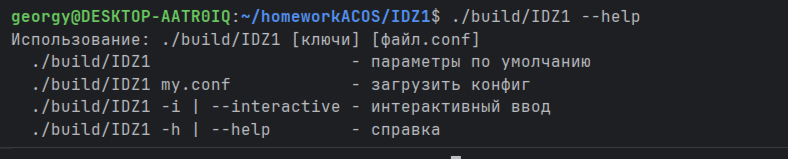
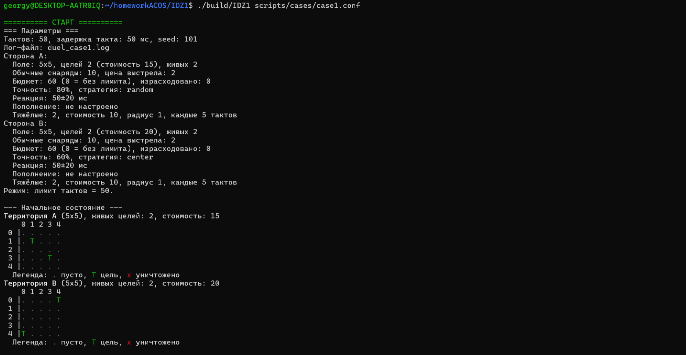
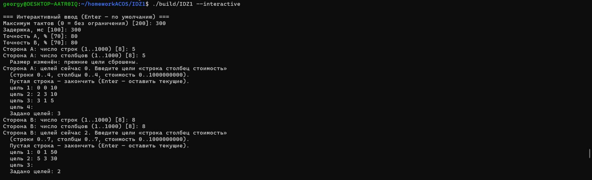
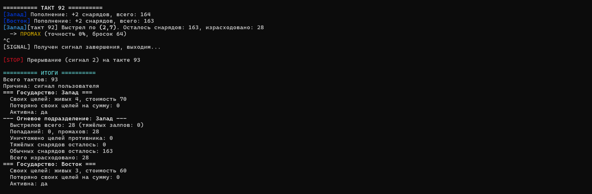
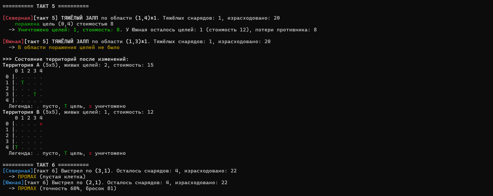
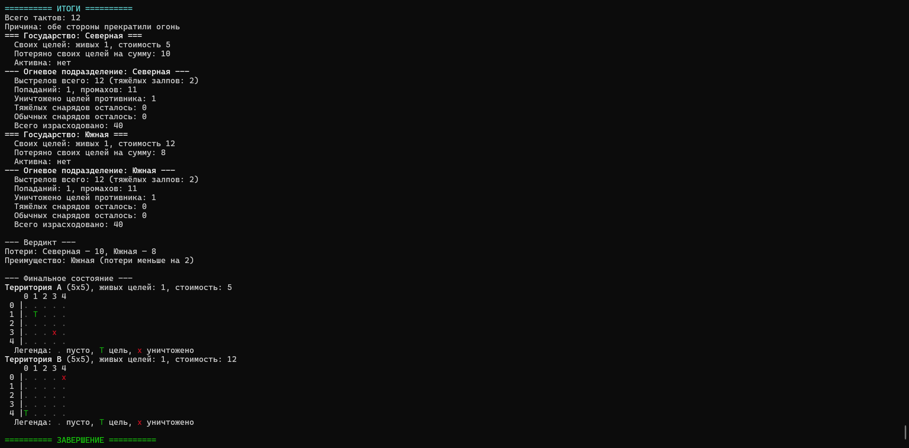
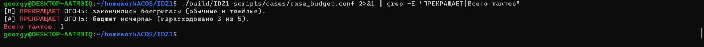
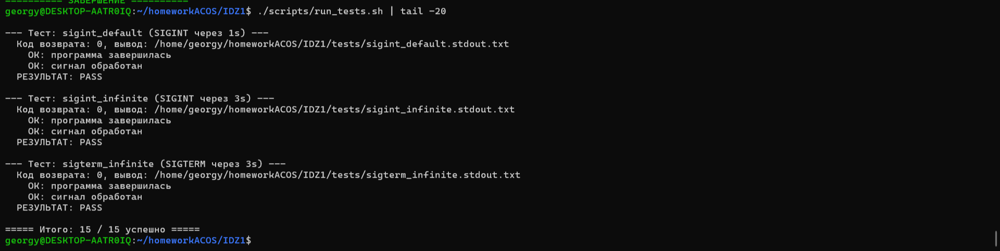

# Отчёт по индивидуальному заданию №1

**Курс:** «Архитектура компьютеров и операционные системы»
**Тема:** Разработка последовательной программы на языке C
**Вариант:** 7 «Два условных государства» (модель миномётного обстрела)
**Исполнитель:** Андрюшко Георгий Павлович
**Группа:** БПИ253
**Год:** 2026

---

## 1. Условие задачи

Два условных государства расположены на прямоугольных клеточных
территориях. На территории каждой стороны размещены цели различного
типа и стоимости. Стороны независимо и асинхронно производят
миномётные выстрелы по координатам территории противника.

Выбор цели может быть случайным или определяться заданной стратегией.
Противники не знают координат целей друг друга.

Попадание в неповреждённую цель уничтожает её и уменьшает суммарную
стоимость оставшихся объектов. Повторное попадание в разрушенную или
пустую клетку не даёт результата. Каждая сторона располагает запасом
снарядов; при расширенном моделировании запас может пополняться с
заданной интенсивностью.

Боевые действия стороны прекращаются, если уничтожены все её цели,
исчерпан запас снарядов либо стоимость израсходованных боеприпасов
достигла установленного экономического ограничения.

**Требуется:** разработать консольное приложение, моделирующее
действия двух сторон.

**Входные параметры:** размеры территорий, число/расположение/стоимость
целей, число и стоимость снарядов, интервалы между выстрелами,
точность и стратегия выбора координат, правила пополнения запасов,
условия экономического прекращения огня.

**Отображаемые события:** выстрел, координаты цели, промах, попадание,
уничтожение объекта, остаток снарядов, стоимость потерь, текущее
состояние обеих территорий.

**Инварианты:**

- выстрел расходует не более одного снаряда;
- одна цель учитывается уничтоженной только один раз;
- стоимость и число оставшихся объектов не становятся отрицательными;
- каждая сторона изменяет только состояние территории противника;
- событие завершения останавливает новые выстрелы стороны.

**Завершение:** двумя принципиально разными способами — естественно
(когда данные это позволяют) либо по прерыванию пользователем в
режиме неограниченного времени.

---

## 2. Сценарий: сущности → процессы и типы данных

Программа реализована как **однопроцессное однопоточное консольное
приложение** с последовательной имитацией параллелизма. Участники
модели отображены в самостоятельные программные конструкции
(структуры и функции), что соответствует требованию ТЗ.

| Сущность | Тип данных | Функции | Роль |
|---|---|---|---|
| Государство | `side_t` | `side_init`, `side_fire`, `side_area_strike`, `side_replenish`, `side_check_done`, `side_print_stats` | территория + огневое подразделение + потери |
| Огневое подразделение | `artillery_t` | `artillery_init`, `artillery_can_fire`, `artillery_can_area_strike`, `artillery_pick_coords`, `artillery_print_stats` | боезапас, бюджет, стратегия, точность |
| Территория | `grid_t` | `grid_init`, `grid_at`, `grid_place_target`, `grid_print` | клеточное поле с целями |
| Цель | `cell_t` | часть `grid_*` | состояние + стоимость |
| Стратегия | `strategy_t` | `artillery_pick_coords` | random / center / sector |
| Координатор | `main` | `main`, `delay_ms`, `delay_reaction`, `tick_replenish` | управление ходами сторон |
| Параметры | `config_t` | `config_defaults`, `config_load`, `config_read_stdin`, `config_print` | загрузка и хранение |

**Сценарий работы:**

1. **Инициализация** — обработчики сигналов, загрузка параметров,
   открытие лога, вывод стартовых карт.
2. **Такт моделирования** — проверки завершения, пополнение запасов,
   ход A, немедленная проверка обеих сторон, пауза реакции,
   ход B, симметричная проверка, пауза `tick_ms`.
3. **Завершение** — итоговая статистика, вердикт, финальные карты,
   закрытие лога.

---

## 3. Пользовательский интерфейс

### 3.1. Командная строка

```
./IDZ1                          — параметры по умолчанию
./IDZ1 my.conf                  — загрузка из файла
./IDZ1 --interactive | -i       — интерактивный ввод
./IDZ1 --help | -h              — справка
```



### 3.2. Формат конфигурационного файла

Текстовый формат `key = value`. Комментарии начинаются с `#`.

**Глобальные параметры:** `max_ticks`, `tick_ms`, `seed`, `log`.

**Параметры стороны** (префикс `A.` или `B.`): `name`, `rows`, `cols`,
`ammo`, `ammo_cost`, `budget`, `accuracy`, `strategy`,
`replenish_every`, `replenish_amount`, `reaction_ms`,
`reaction_jitter_ms`, `area_ammo`, `area_cost`, `area_radius`,
`area_every`, `target`.

### 3.3. Вывод программы

Вывод информативен, отражает все ключевые события предметной области:

- параметры обеих сторон (поле, цели, боезапас, бюджет, точность,
  стратегия, пополнение, реакция, тяжёлые снаряды);
- цветная ASCII-карта территорий с координатными осями;
- каждое событие выстрела с координатами, остатком снарядов и расходом;
- промах/попадание с указанием причины и текущих потерь противника;
- сообщения о пополнении и о прекращении огня;
- итоговая статистика и вердикт.



### 3.4. Интерактивный режим

При запуске с ключом `--interactive` программа последовательно
запрашивает у пользователя параметры:

1. **Общие:** максимум тактов, пауза между тактами.
2. **Для каждой стороны:**
    - точность стрельбы (0–100);
    - размеры территории — число строк и столбцов (1–1000);
    - список целей в формате `строка столбец стоимость`.

Ввод целей выполняется в цикле, по одной в строке. Пустая строка
завершает ввод; если сразу нажать Enter, текущие цели сохраняются,
а если ввести хотя бы одну — прежний набор заменяется новым.

Все вводимые значения **валидируются**:

- числовые параметры проверяются на диапазон;
- для целей проверяются координаты (границы поля), стоимость
  (0..1000000000), формат строки, отсутствие повторного размещения
  на занятой клетке.

При ошибке ввода значение отклоняется с сообщением, и программа
продолжает запрос. Работа прерывается корректно по `Ctrl+C`.



### 3.5. Логирование

Все события дублируются в лог-файл. ANSI-escape-последовательности
при записи **вырезаются** — лог остаётся чистым текстом.

### 3.6. Цветной вывод

ANSI-цвета: зелёный `T`, красный `x`, жёлтый — промахи, зелёный —
попадания, красный жирный — тяжёлые залпы. Цвета автоматически
отключаются при перенаправлении вывода в файл.

---

## 4. Варианты запуска и завершения

### 4.1. Способы запуска

1. **Параметры по умолчанию** — `./IDZ1`.
2. **Из файла** — `./IDZ1 scripts/cases/case1.conf`.
3. **Интерактивный ввод** — `./IDZ1 --interactive`.

Интерактивный режим позволяет задать не только такты, задержку и
точность, но и **размеры территорий и список целей** для каждой
стороны. Все вводимые значения валидируются.

### 4.2. Варианты завершения

Ключевая идея: программа может выполняться долго или бесконечно
в зависимости от данных (вполне корректных). Поэтому она должна
корректно завершаться **двумя принципиально разными способами**:
естественно (когда данные это позволяют) или по прерыванию
пользователем. Оба реализованы и работают.

**А. Естественное** — программа останавливается сама:
- сторона прекращает огонь, если у неё уничтожены все собственные
  цели, у противника не осталось живых целей, закончились боеприпасы
  (и не назначено пополнение) или бюджет не позволяет следующий выстрел;
- либо достигнут общий лимит тактов `max_ticks` (если он задан).

**Б. По прерыванию** — при получении сигнала `SIGINT` (Ctrl+C) или
`SIGTERM`. Работает в том числе в режиме неограниченного времени
(`max_ticks = 0`), когда естественное завершение невозможно.

Программа однопоточная. Параллелизм имитируется в цикле координатора
(как в старых играх), задержки между ходами формируются генератором
случайных чисел. Реальная синхронизация не требуется — поток один.



### 4.3. Гарантированно бесконечный сценарий

`case2.conf`: `max_ticks=0`, `accuracy=0`, пополнение `+2/такт`.
Естественное завершение невозможно — только сигнал.

### 4.4. Инвариант «завершение останавливает выстрелы»

`side_check_done` вызывается до первого такта, после хода A (обе
стороны) и после хода B (обе стороны). Сторона не сделает ни одного
нового выстрела после срабатывания условия завершения.

---

## 5. Инварианты: как соблюдаются

| Инвариант | Реализация |
|---|---|
| Один выстрел = один снаряд | `ammo_left--` или `area_ammo--` ровно один раз за ход |
| Цель учитывается один раз | переход `CELL_TARGET → CELL_DESTROYED` только из `CELL_TARGET` |
| Стоимость и число целей ≥ 0 | уменьшение только при переходе из `CELL_TARGET`; стоимости (`initial_cost`, `alive_cost`, `lost_cost`) — `int64_t` |
| Сторона меняет только чужую территорию | `side_fire`/`side_area_strike` получают `victim->grid` |
| Завершение останавливает выстрелы | `side_check_done` после каждого хода; `active = 0` |

---

## 6. Системные вызовы и libc

**Системные вызовы:** `write`, `read`, `open`, `close`, `nanosleep`,
`sigaction`, `isatty`.

**Функции libc:** `malloc`/`calloc`/`free`, `snprintf`/`vsnprintf`/
`sscanf`, `strlen`/`strcmp`/`strncpy`/`strchr`/`strtol`/`strtoll`,
`rand`/`srand`.

Весь ввод-вывод идёт через **файловые дескрипторы** — это соответствует
дополнительному требованию.

---

## 7. Результаты работы

### 7.1. Сценарий 1 — базовая модель с тяжёлыми залпами

```
./build/IDZ1 scripts/cases/case1.conf
```

Поле 5×5, по 2 цели у каждой стороны, по 10 снарядов, бюджет 60,
точность A=80%, B=60%. Программа завершилась **естественно** на 12-м
такте — обе стороны исчерпали боеприпасы.

Фрагмент лога (тяжёлый залп):

```
========== ТАКТ 5 ==========

[Северная][такт 5] ТЯЖЁЛЫЙ ЗАЛП по области (3,2)±1. Тяжёлых снарядов: 1, израсходовано: 20
  -> В области поражения целей не было

[Южная][такт 5] ТЯЖЁЛЫЙ ЗАЛП по области (1,1)±1. Тяжёлых снарядов: 1, израсходовано: 20
    поражена цель (1,1) стоимостью 5
  -> Уничтожено целей: 1, стоимость: 5. У Северная осталось целей: 1 (стоимость 10), потери противника: 5
```



Итоговая статистика:

```
========== ИТОГИ ==========
Всего тактов: 12
Причина: обе стороны прекратили огонь
=== Государство: Северная ===
  Своих целей: живых 1, стоимость 10
  Потеряно своих целей на сумму: 5
  Активна: нет
--- Огневое подразделение: Северная ---
  Выстрелов всего: 10 (тяжёлых залпов: 2)
  Попаданий: 1, промахов: 11
  Уничтожено целей противника: 1
  Тяжёлых снарядов осталось: 0
  Обычных снарядов осталось: 0
  Всего израсходовано: 40
=== Государство: Южная ===
  Своих целей: живых 1, стоимость 8
  Потеряно своих целей на сумму: 12
  Активна: нет
--- Огневое подразделение: Южная ---
  Выстрелов всего: 10 (тяжёлых залпов: 2)
  Попаданий: 1, промахов: 11
  Уничтожено целей противника: 1
  Тяжёлых снарядов осталось: 0
  Обычных снарядов осталось: 0
  Всего израсходовано: 40
```



### 7.2. Сценарий 2 — бесконечный режим, прерывание по SIGINT

```
./build/IDZ1 scripts/cases/case2.conf
# через 5 секунд: Ctrl+C
```

Поле 10×10, `accuracy=0`, пополнение +2 каждый такт, `max_ticks=0`.
Программа работала 193 такта до сигнала пользователя:

```
^C
[SIGNAL] Получен сигнал завершения, выходим...

[STOP] Прерывание (сигнал 2) на такте 192

========== ИТОГИ ==========
Всего тактов: 193
Причина: сигнал пользователя
...
========== ЗАВЕРШЕНИЕ ==========
```

### 7.3. Сценарий 3 — разные радиусы тяжёлого залпа

```
./build/IDZ1 scripts/cases/case3_area.conf
```

A: радиус залпа 1, B: радиус 2. Артиллеристы (A) тяжёлым залпом
уничтожили последнюю цель Пехоты на 8-м такте — обе стороны сразу
прекратили огонь.

### 7.4. Минимальный сценарий — проверка инварианта

```
./build/IDZ1 scripts/cases/case_tiny.conf
```

Поле 1×1, по одной цели, по одному снаряду, точность 100%.

```
========== ТАКТ 0 ==========
[A][такт 0] Выстрел по (0,0). Осталось снарядов: 0
  -> ПОПАДАНИЕ! Уничтожена цель стоимостью 10. У B осталось целей: 0
[A] ПРЕКРАЩАЕТ ОГОНЬ: у противника не осталось целей.
[B] ПРЕКРАЩАЕТ ОГОНЬ: все свои цели уничтожены.

[STOP] Никто не может продолжать огонь.
Всего тактов: 1
```

**Ключевой момент:** сторона B **не сделала ни одного выстрела** —
инвариант «событие завершения останавливает новые выстрелы» соблюдён.

### 7.5. Проверка причины остановки по бюджету

```
./build/IDZ1 scripts/cases/case_budget.conf
```

Две стороны с разными причинами:

```
[B] ПРЕКРАЩАЕТ ОГОНЬ: закончились боеприпасы (обычные и тяжёлые).
[A] ПРЕКРАЩАЕТ ОГОНЬ: бюджет исчерпан (израсходовано 3 из 5).
Всего тактов: 1
```



### 7.6. Проверка работы `tick_ms`

```
cd build
echo "tick_ms=0:";   time ./IDZ1 ../scripts/cases/t_tick0.conf   > /dev/null
echo "tick_ms=500:"; time ./IDZ1 ../scripts/cases/t_tick500.conf > /dev/null
```

Результат:

```
tick_ms=0:
real    0m0.005s

tick_ms=500:
real    0m1.505s
```

Разница ровно `3 × 500 мс = 1.5 сек` — `tick_ms` реально
используется.

### 7.7. Проверка отсутствия переполнения

```
./build/IDZ1 scripts/cases/case_overflow.conf
```

30 000 выстрелов × 100 000 стоимости = 3 000 000 000. Значение
превышает `INT_MAX`, но благодаря `int64_t` выводится корректно:

```
Всего израсходовано: 3000000000
```

### 7.8. Автотесты

```
./scripts/run_tests.sh
```

15 сценариев, включая базовые конфиги, минимальный инвариант,
бюджет, переполнение, пополнение, разные причины остановки,
SIGINT, SIGTERM, бесконечный режим.

```
===== Итого: 15 / 15 успешно =====
```



---

## 8. Дополнительно реализовано

1. libc + системные вызовы через дескрипторы.
2. Комментарии ко всем модулям.
3. Обработка `SIGINT` и `SIGTERM`.
4. Лог-файл без ANSI-мусора.
5. Конфигурационные файлы (11 штук) и скрипт автотестов.
6. Тяжёлый (площадной) залп.
7. Три стратегии выбора координат.
8. Экономический лимит с раздельной диагностикой причины.
9. Регулируемые задержки.
10. Воспроизводимый seed ГСЧ.
11. ANSI-цвета с автоотключением при перенаправлении.
12. Координатные оси на картах.
13. Валидация конфигурации.
14. Обработка длинных строк конфига.
15. Расширенный интерактивный режим — помимо базовых параметров
    (такты, пауза, точность), пользователь может задать размеры
    территорий и список целей для каждой стороны, с полной
    валидацией ввода.

---

## 9. Структура проекта

```
IDZ1/
├── CMakeLists.txt
├── README.md
├── REPORT.md
├── .gitignore
├── screenshots/         — скриншоты для отчёта
├── include/             — заголовки (.h)
├── src/                 — исходники (.c)
└── scripts/
    ├── run_tests.sh
    └── cases/           — 11 тестовых конфигов
```

## 10. Сборка и запуск

```bash
mkdir -p build && cd build
cmake .. -G Ninja
ninja
cd ..
./build/IDZ1 scripts/cases/case1.conf
./scripts/run_tests.sh
```

---

## Приложение А. Пример лога

Фрагмент `duel_case1.log` (без ANSI-кодов):

```
========== СТАРТ ==========
=== Параметры ===
Тактов: 50, задержка такта: 50 мс, seed: 101
Лог-файл: duel_case1.log
Сторона A:
  Поле: 5x5, целей 2 (стоимость 15), живых 2
  Обычные снаряды: 10, цена выстрела: 2
  Бюджет: 60 (0 = без лимита), израсходовано: 0
  Точность: 80%, стратегия: random
  Реакция: 200±100 мс
  Пополнение: не настроено
  Тяжёлые: 2, стоимость 10, радиус 1, каждые 5 тактов
...
========== ЗАВЕРШЕНИЕ ==========
```